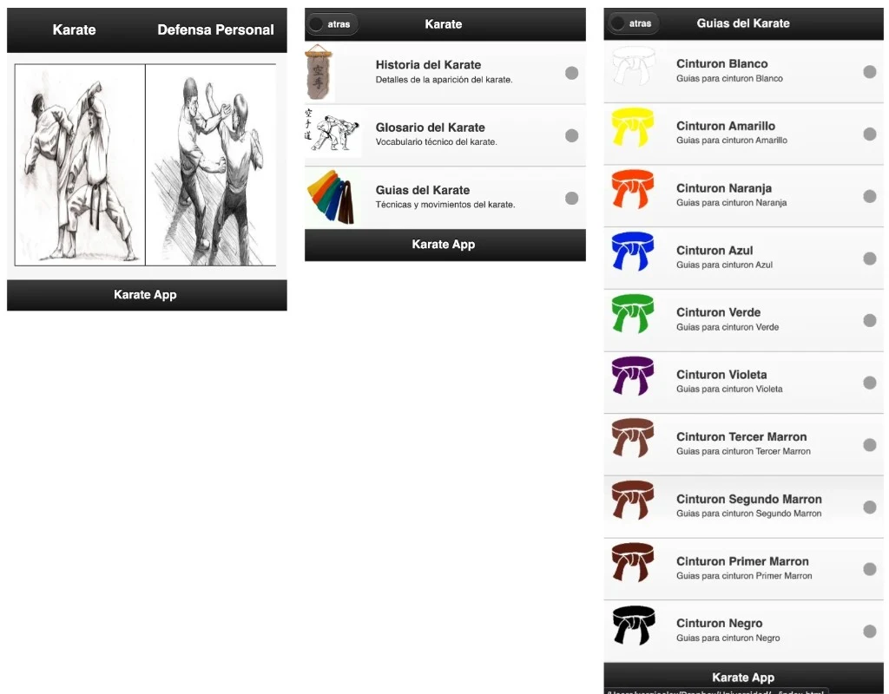
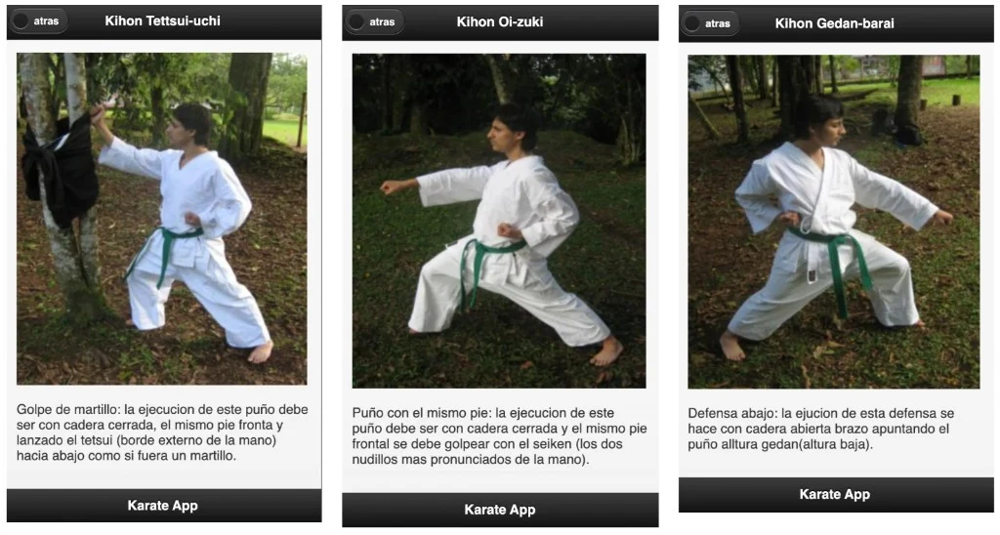

# KDoSensei (Karate App)

This repository holds the web layer of **KDoSensei**. **In 2013 I built it as part of a university project**—together with **Camilo** and **Miguel**—that asked us to take an idea from concept to a working mobile experience. **Miguel practiced Karate**, and we thought it would be **interesting to build a mobile app around that**—a topic we could ground in someone’s real training instead of choosing something arbitrary. We framed the product around **Karate and self-defense education**, and set out to deliver something people could actually install and use, not just a slide deck.

We used **PhoneGap** (and the **Cordova** ecosystem) so we could ship from the web stack we already knew—HTML, CSS, and JavaScript—while still targeting Android without rewriting the whole product in native code. Screens, assets, and the quirks of hybrid tooling were all part of that semester’s deliverables and documentation.

**Years later**, while **going through my old university files and backups**, I **ran into this project again**. I wanted to **keep it around like a time machine**—an intact snapshot of that semester, the team, and the hybrid tooling—instead of losing it in a dusty zip or an old drive, so I **put the web assets back online** at **[https://kdosensei.xergioalex.com](https://kdosensei.xergioalex.com)** and collected them in this repository.

## Live site

The recovered web app is hosted here:

**[https://kdosensei.xergioalex.com](https://kdosensei.xergioalex.com)**

## Screenshots (2013)

Reference composites from the original **Karate App** as it shipped in the PhoneGap shell: glossy black bars, **Spanish** UI, **Karate** vs **Defensa personal** entry, main menu (**Historia del Karate**, **Glosario**, **Guías del Karate** with belt list), and example **kihon** screens with photo plus short technique text.

## What we set out to build (2013)

The core idea was an **illustrated guide**—with room to grow into richer **multimedia**—aimed at **self-taught** practice of Karate and a few **basic self-defense** concepts.

What we wanted to differentiate was:

- **Belt-by-belt guidance** — clear illustration and explanation of the techniques and movements associated with each belt level in Karate.
- **Self-defense as a parallel track** — an intentional, innovative addition alongside traditional Karate curriculum.
- **An illustrated glossary** — technical Karate terms explained visually and in context, so learners could grasp the language of the art, not only the movements.

When we looked at what existed in the market, the elements that stood out as **most distinctive** were exactly that **illustrated technical glossary** and the **self-defense guide**. The glossary helps newcomers understand the foundations of the discipline; the self-defense material offers a **second, complementary path** for anyone building confidence in practical confrontation skills.

(That framing came from our original project summary and competitive scan at the time.)

## Tech stack

- **Apache Cordova / Adobe PhoneGap** — hybrid shell around the web UI for mobile distribution.
- **Static web assets** in `www/` (HTML, CSS, images)—this repo focuses on that layer.

## Repository layout

- `www/` — application entry (`index.html`), styles, media, and historical `config.xml` for the PhoneGap/Cordova widget metadata.

## License

See [LICENSE](LICENSE).